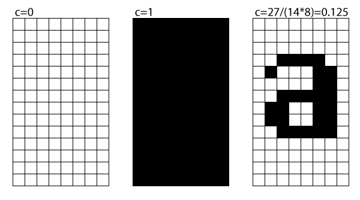
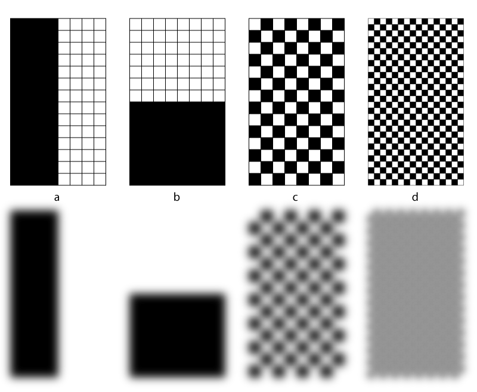

#A calculation for the gray level of text

As any introduction to typography will tell you, font families come in different *weights*, ranging from thin to black and many steps in between. These weights are used to create hierarchies and structure within the text. A bold headline will catch the attention. A lighter weight for reading, etc. While the word **weight** has connotations of physics and empirical envidence, the typographic reality is a bit messy. Let's start by having a look at the data in the font.

##Names
While care is given to *naming* the different weights within a family, there are great differences *between* typefaces. There is no guarantee that the *bold* in one typeface has the same weight as a similarly named weight in another. This is usually not really a problem: typographers, designers and anyone selecting a font will do so by looking at the font first and not rely on the name. Bottom line is that the font name does not really provide reliable information about the weight.

##WeightClass
The OpenType font format has the ** usWeightClass** value [[specification]](https://www.microsoft.com/typography/otspec/os2.htm#wtc). On a scale between 0 to 1000, this value can be used, for instance, to order the weights in a font in a menu, or to select a weight that is "bolder" than the current font. That looks more promising.
Unfortunately, assigning the fontWeight value is not easy: older applications expect this value only in steps of 100 and some even respond with unexpected results to values under 250. There is not much room for families with many weights, the values have to be assigned "by hand" and often represent some sort of ranking and is seperate from any geometry in the font. So, like the font names, the fontWeight value can not really be used to make objective comparisons between typefaces.

##Ink
But the weight differences are real: we can observe them by looking at text. So maybe we need to see how the individual marks on the page contribute to the weight of the text. And then work our way up. A glyph in a Latin font has a rectangle that is defined by its advance width and a height: either the font's units per em value, or the distance between ascender and descender. The shapes in the glyph may stick out of the rectangle, but generally they don't.
In simple text shaping these rectangles are lined up next to each other. There are of course many, much more complex ways in which the glyphs can be arranged.

Assuming the shape is drawn with black on a white background and that the shape does not exceed the boundaries of the width or height, then the gray scale is going to be between black and white. 

 If there is no shape in the letter, the level is white. If the shape covers everything the result will be black. And then the steps in between. Here I need to remark that there are many shapes where this would not be true. For instance, a filled with a fine chess board pixel grid (one off, one on) would produce the same numerical result as a glyph that has a single black box on the bottom half. Optically these would not be the same at all. But I'm assuming we're looking at *normal fonts* and I'm permitting myself the luxury of not even defining what those are. You know what they are and there will be some averaging later on anyway.

### The coverage of a single glyph

`gray level = area of the shape / (glyph advance width * units per em)`

This is a number that can be calculated with relative ease and speed. 

Different ways in which the assumption that the coverage is based on can fail. All of the images above will have a 50% coverage result. But (permitting a Gaussian blur to stand in for the diffraction in the eye) obviously **b** will appear as a much darker shape than **d**. So, if applied to a oddball fonts the results might not be very reliable.

## Text
Suppose we calculate this gray level for each glyph in a font. Then what? A **numerical average** of all these results will not produce a value that is useful. We need to look at how the font behaves in text. This introduces a new factor: language. We need to know how often a certain shape appears. The next question is then: which language?
We need to make sure the tables are case sensitive: the frequencies of initial capitals in different languages are quite different from the lowercase frequencies. These values need to be normalized so that the sum of all frequencies is 1.

### The gray level of a set of glyphs, in one language
`coverage of one font in one language = sum of (gray level of a glyph) * (normalized glyph frequency)`

### Average of >1 languages
The numerical average of the densities calculated for a couple of languages can then be used as an relatively objective value for the color, or gray, of a specific font.

## Discussion
The frequency tables used in this calculation do not include punctuation. In many typefaces the punctuation symbols are lighter than the letters and that would skew the results towards a lighter number. But then the texts used to compile the frequency tables would need to be examined as well. Are all the texts on a comparable subject for instance? How do the average line lengths compare? Are there more or fewer quotations in the text? How does the word space fit in all this? 

Such deep statistical analysis really is a different project. The languages are there to make sure there is no bias towards one specific language just by choosing one single frequency table.

* The tables fairly represent the use of capitals and lowercase in a specific language.
* Capitals and lowercase are the most interesting thing to measure in a font.
* The tables used are all for languages that use the Latin script.
* The font width is definitely a factor that might make the results less useful in extreme designs: wider typefaces have more weight in the glyph rectangle.
* In order to be able to compare different typefaces it is necessary to calculate the densities *with the same frequency tables.* Which makes it difficult to compare across scripts. 
* I'm ignoring the effects kerning and tracking will have on the coverage. This will definitely be an interesting addition, it could factor in pair frequencies, but these would need to be correlated with the character frequencies.
* I'm also ignoring any effects that might be caused by lighting conditions, the reading distance and type size, or any conditions of the eye.
* Between the languages there are not only differences between the frequencies, but also between the charactersets. If we're analysing a font that is being worked on it might not have all the characters that a language needs. Rather then make assumptions about certain characters, we need to check first if a font has all the characters required by the table.

## Code
* The code in this package is for [RoboFont](http://doc.robofont.com). 
* **getFontCoverage(font)** calculates the coverage for a single font, using frequency tables for 27 different languages. It's reasonably fast but could be optimized. 
* **calculateGlyphCoverage(glyph, font)** calculates the coverage for a single glyph.
* The module `data.py` exports a frequency table and a function that filters the supported languages based on the glyphs in the font. 

## Todo
* Calculate complete families, find fonts that have similar results, verify if these actually appear to have the same weight.
* Perhaps weigh the shapes inside the xheight more than the shapes above or below.
* Incorporate kerning pair frequencies for the languages in the table. Perhaps do the math for a single language first to get an idea of how much of a difference it would make.

## Acknowledgements
* Thanks to [Bianca Berning](https://twitter.com/bianca_berning) for sharing the results of her frequency analysis.
* [Frederik Berlaen](https://twitter.com/typemytype?lang=en) for solving **DecomposePointPen**.